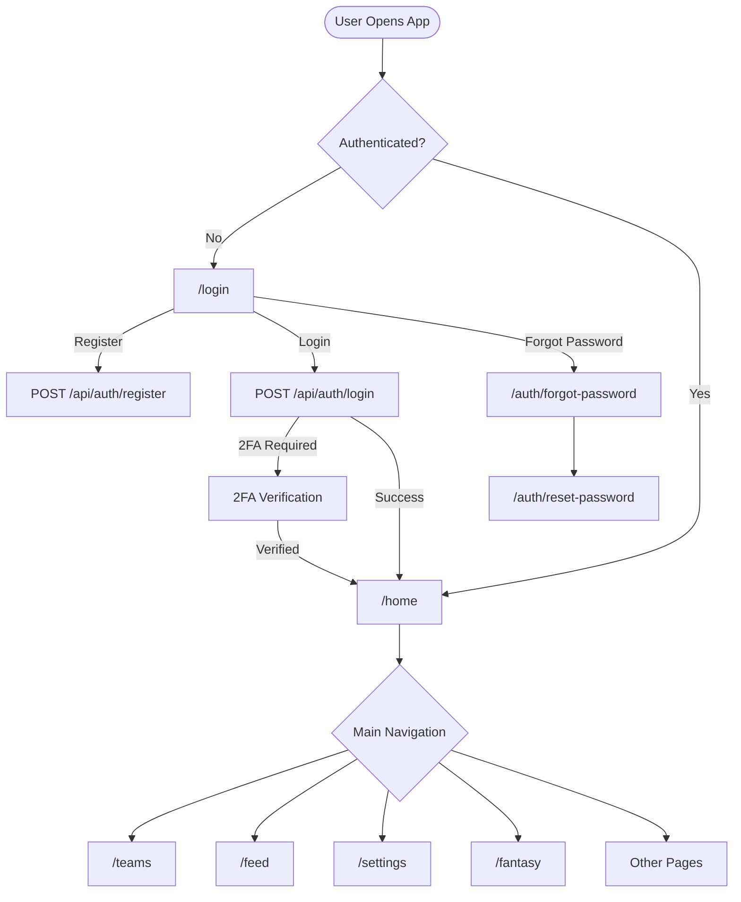
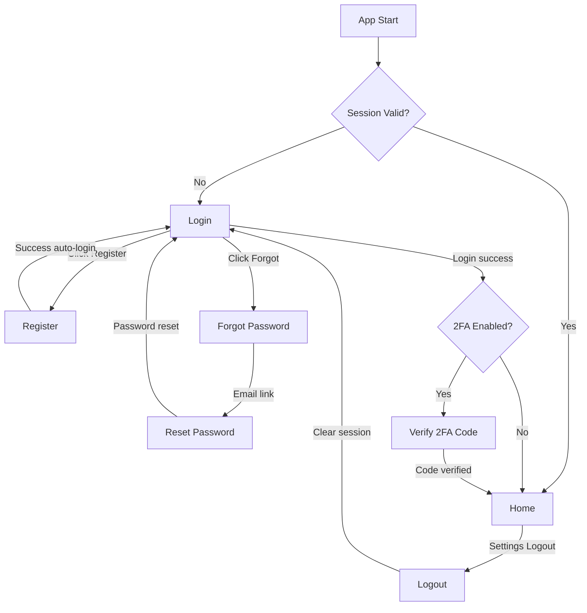
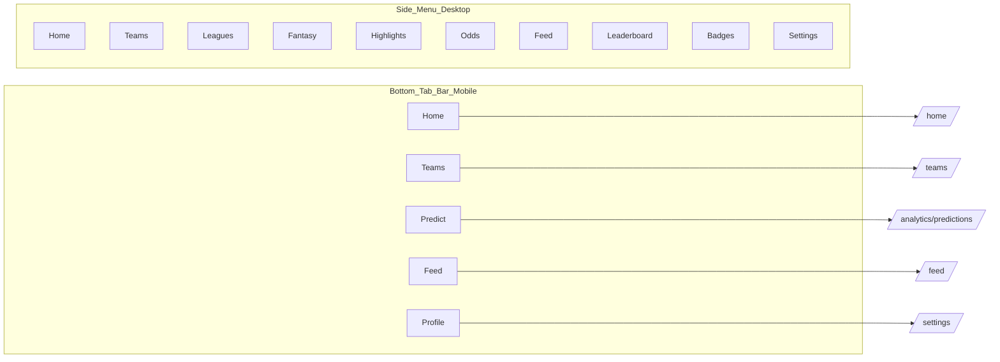

# FootDash — Application Routes & Navigation Guide

> **Last updated:** March 6, 2026
> **Purpose:** Complete reference of all frontend routes, backend API endpoints, and the navigation flow between pages.

---

## Table of Contents

1. [Application Flow Overview](#application-flow-overview)
2. [Route Map](#route-map)
   - [Public Routes (No Auth)](#public-routes-no-auth)
   - [Authenticated Routes (Free Tier)](#authenticated-routes-free-tier)
   - [Pro-Only Routes](#pro-only-routes)
   - [Admin Routes](#admin-routes)
3. [Navigation Diagrams](#navigation-diagrams)
   - [Auth Flow](#auth-flow)
   - [Main App Navigation](#main-app-navigation)
   - [Feature Module Flow](#feature-module-flow)
4. [Backend API Endpoints](#backend-api-endpoints)
5. [Route Guards](#route-guards)
6. [How to Access Each Page](#how-to-access-each-page)

---

## Application Flow Overview

---

## Route Map

### Public Routes (No Auth)

| Route | Page | Description | URL |
|-------|------|-------------|-----|
| `/login` | LoginPage | Sign in / register | [http://localhost:4200/login](http://localhost:4200/login) |
| `/auth/forgot-password` | ForgotPasswordPage | Request password reset | [http://localhost:4200/auth/forgot-password](http://localhost:4200/auth/forgot-password) |
| `/auth/reset-password` | ResetPasswordPage | Reset password with token | [http://localhost:4200/auth/reset-password](http://localhost:4200/auth/reset-password) |
| `/404` | NotFoundPage | Page not found | [http://localhost:4200/404](http://localhost:4200/404) |
| `/error` | ErrorPage | Generic error page | [http://localhost:4200/error](http://localhost:4200/error) |

### Authenticated Routes (Free Tier)

| Route | Page | Description | URL |
|-------|------|-------------|-----|
| `/home` | HomePage | Dashboard with overview | [http://localhost:4200/home](http://localhost:4200/home) |
| `/teams` | TeamsPage | Browse/manage favorite teams | [http://localhost:4200/teams](http://localhost:4200/teams) |
| `/matches/:teamId` | MatchesPage | Team fixtures & results | [http://localhost:4200/matches/1](http://localhost:4200/matches/1) |
| `/match/:matchId` | MatchDetailsPage | Single match details | [http://localhost:4200/match/1](http://localhost:4200/match/1) |
| `/onboarding` | OnboardingPage | New user setup wizard | [http://localhost:4200/onboarding](http://localhost:4200/onboarding) |
| `/notifications` | NotificationsPage | Notification center | [http://localhost:4200/notifications](http://localhost:4200/notifications) |
| `/settings` | SettingsPage | User settings | [http://localhost:4200/settings](http://localhost:4200/settings) |
| `/search` | SearchResultsPage | Search teams/matches | [http://localhost:4200/search](http://localhost:4200/search) |
| `/leaderboard` | LeaderboardPage | Prediction rankings | [http://localhost:4200/leaderboard](http://localhost:4200/leaderboard) |
| `/badges` | BadgesPage | Achievement badges | [http://localhost:4200/badges](http://localhost:4200/badges) |
| `/export` | ExportPage | Data export | [http://localhost:4200/export](http://localhost:4200/export) |
| `/pro` | ProPage | Pro subscription info | [http://localhost:4200/pro](http://localhost:4200/pro) |
| `/payments/success` | PaymentSuccessPage | Payment confirmation | [http://localhost:4200/payments/success](http://localhost:4200/payments/success) |
| `/user-profile/:id` | UserProfilePage | View user profiles | [http://localhost:4200/user-profile/8](http://localhost:4200/user-profile/8) |
| `/feed` | FeedPage | Social feed & activity | [http://localhost:4200/feed](http://localhost:4200/feed) |
| `/match-discussion/:id` | MatchDiscussionPage | Match chat room | [http://localhost:4200/match-discussion/1](http://localhost:4200/match-discussion/1) |
| `/leagues` | LeaguesPage | Browse football leagues | [http://localhost:4200/leagues](http://localhost:4200/leagues) |
| `/leagues/:id/standings` | LeagueStandingsPage | League table/standings | [http://localhost:4200/leagues/1/standings](http://localhost:4200/leagues/1/standings) |
| `/fantasy` | FantasyHomePage | Fantasy league home | [http://localhost:4200/fantasy](http://localhost:4200/fantasy) |
| `/fantasy/league/:id` | FantasyLeaguePage | Fantasy league detail | [http://localhost:4200/fantasy/league/1](http://localhost:4200/fantasy/league/1) |
| `/fantasy/league/:id/team/:teamId` | FantasyTeamPage | Fantasy team detail | [http://localhost:4200/fantasy/league/1/team/1](http://localhost:4200/fantasy/league/1/team/1) |
| `/fantasy/league/:id/transfers` | FantasyTransferMarketPage | Transfer market | [http://localhost:4200/fantasy/league/1/transfers](http://localhost:4200/fantasy/league/1/transfers) |
| `/highlights` | HighlightsPage | Match highlights/videos | [http://localhost:4200/highlights](http://localhost:4200/highlights) |
| `/odds` | OddsPage | Betting odds comparison | [http://localhost:4200/odds](http://localhost:4200/odds) |

### Pro-Only Routes

These routes require `authGuard` + `proGuard`. Free users are redirected to `/pro`.

| Route | Page | Description | URL |
|-------|------|-------------|-----|
| `/analytics/match/:matchId` | MatchPredictionPage | AI match predictions | [http://localhost:4200/analytics/match/1](http://localhost:4200/analytics/match/1) |
| `/analytics/team/:teamId` | TeamAnalyticsPage | Team performance analytics | [http://localhost:4200/analytics/team/1](http://localhost:4200/analytics/team/1) |
| `/analytics/predictions` | PredictionAnalyticsPage | Prediction accuracy dashboard | [http://localhost:4200/analytics/predictions](http://localhost:4200/analytics/predictions) |
| `/compare` | TeamComparePage | Head-to-head team compare | [http://localhost:4200/compare](http://localhost:4200/compare) |

### Admin Routes

Requires `authGuard` + `adminGuard`. Only users with `role = ADMIN` can access.

| Route | Page | Description | URL |
|-------|------|-------------|-----|
| `/admin` | AdminPage | Admin dashboard | [http://localhost:4200/admin](http://localhost:4200/admin) |

---

## Navigation Diagrams

### Auth Flow

### Main App Navigation

### Feature Module Flow

```mermaid
flowchart TD
    subgraph Teams_and_Matches
        Teams[/teams/] -->|Select team| Matches[/matches/:teamId/]
        Matches -->|Select match| MatchDetail[/match/:matchId/]
        MatchDetail -->|Predict Pro| MatchPred[/analytics/match/:matchId/]
        MatchDetail -->|Discuss| Discussion[/match-discussion/:id/]
        Teams -->|Analytics Pro| TeamAnalytics[/analytics/team/:teamId/]
    end

    subgraph Leagues
        LeaguesHome[/leagues/] -->|Select league| Standings[/leagues/:id/standings/]
    end

    subgraph Fantasy
        FantasyHome[/fantasy/] -->|Select or create league| FantasyLeague[/fantasy/league/:id/]
        FantasyLeague -->|View team| FantasyTeam[/fantasy/league/:id/team/:teamId/]
        FantasyLeague -->|Transfers| TransferMkt[/fantasy/league/:id/transfers/]
    end

    subgraph Social
        Feed[/feed/] -->|User avatar| UserProfile[/user-profile/:id/]
        Discussion2[/match-discussion/:id/] -->|User avatar| UserProfile
    end

    subgraph Gamification
        Leaderboard[/leaderboard/]
        Badges[/badges/]
    end

    subgraph Content
        Highlights[/highlights/]
        Odds[/odds/]
    end

    subgraph Pro_and_Subscription
        ProPage[/pro/] -->|Subscribe| PaySuccess[/payments/success/]
    end
```

---

## Backend API Endpoints

### Health
| Method | Endpoint | Auth | Description |
|--------|----------|------|-------------|
| GET | `/api/health` | ❌ | Health check |

### Auth (`/api/auth`)
| Method | Endpoint | Auth | Description |
|--------|----------|------|-------------|
| POST | `/api/auth/register` | ❌ | Register new user |
| POST | `/api/auth/login` | ❌ | Login (returns JWT) |
| POST | `/api/auth/refresh` | ❌ | Refresh access token |
| POST | `/api/auth/revoke` | ❌ | Logout / revoke token |
| GET | `/api/auth/profile` | ✅ | Get current user |
| POST | `/api/auth/change-password` | ✅ | Change password |
| POST | `/api/auth/forgot-password` | ❌ | Request reset email |
| POST | `/api/auth/reset-password` | ❌ | Reset with token |
| GET | `/api/auth/2fa/status` | ✅ | 2FA status |
| POST | `/api/auth/2fa/setup` | ✅ | Generate 2FA secret |
| POST | `/api/auth/2fa/verify` | ✅ | Verify 2FA code |
| POST | `/api/auth/2fa/enable` | ✅ | Enable 2FA |
| POST | `/api/auth/2fa/disable` | ✅ | Disable 2FA |
| GET | `/api/auth/sessions` | ✅ | List active sessions |
| DELETE | `/api/auth/sessions/:id` | ✅ | Revoke session |

### Teams (`/api/teams`)
| Method | Endpoint | Auth | Description |
|--------|----------|------|-------------|
| GET | `/api/teams` | ❌ | List teams (paginated) |
| GET | `/api/teams/:teamId` | ❌ | Team details |
| GET | `/api/teams/:teamId/stats` | ❌ | Team statistics |
| GET | `/api/teams/:teamId/matches` | ❌ | Team matches |
| POST | `/api/teams` | ❌ | Create team |
| POST | `/api/teams/:teamId/sync` | ❌ | Sync from API |

### Matches (`/api/matches`)
| Method | Endpoint | Auth | Description |
|--------|----------|------|-------------|
| GET | `/api/matches/:id` | ❌ | Match details |
| GET | `/api/matches/:id/lineups` | ❌ | Match lineups |
| GET | `/api/matches/team/:teamId` | ❌ | Team matches |
| POST | `/api/matches/team/:teamId/sync` | ❌ | Sync fixtures |

### Leagues (`/api/leagues`)
| Method | Endpoint | Auth | Description |
|--------|----------|------|-------------|
| GET | `/api/leagues` | ❌ | List leagues |
| GET | `/api/leagues/:id` | ❌ | League details |
| GET | `/api/leagues/:id/standings` | ❌ | Standings |
| GET | `/api/leagues/:id/matches` | ❌ | League fixtures |

### Fantasy (`/api/fantasy`)
| Method | Endpoint | Auth | Description |
|--------|----------|------|-------------|
| POST | `/api/fantasy/leagues` | ✅ | Create fantasy league |
| POST | `/api/fantasy/leagues/join` | ✅ | Join via invite code |
| GET | `/api/fantasy/leagues` | ✅ | My fantasy leagues |
| GET | `/api/fantasy/leagues/:id` | ✅ | League details |
| GET | `/api/fantasy/leagues/:id/standings` | ✅ | League standings |
| GET | `/api/fantasy/teams/:id` | ✅ | Fantasy team |
| GET | `/api/fantasy/teams/:id/market` | ✅ | Transfer market |
| PUT | `/api/fantasy/teams/:id/squad` | ✅ | Set squad |
| POST | `/api/fantasy/teams/:id/transfer` | ✅ | Make transfer |
| GET | `/api/fantasy/gameweeks/:id/results` | ✅ | Gameweek results |

### Analytics (`/api/analytics`)
| Method | Endpoint | Auth | Description |
|--------|----------|------|-------------|
| GET | `/api/analytics/match/:matchId/prediction` | ❌ | Match prediction |
| POST | `/api/analytics/match/:matchId/predict` | ❌ | Generate prediction |
| GET | `/api/analytics/upcoming-predictions` | ❌ | Upcoming predictions |
| GET | `/api/analytics/predictions/stats` | ❌ | Prediction stats |
| GET | `/api/analytics/ml/health` | ❌ | ML service health |
| GET | `/api/analytics/ml/metrics` | ❌ | ML metrics |
| GET | `/api/analytics/match/:matchId/prediction/btts` | ❌ | BTTS prediction |
| GET | `/api/analytics/match/:matchId/prediction/over-under` | ❌ | Over/Under |
| GET | `/api/analytics/team/compare` | ❌ | Compare teams |
| GET | `/api/analytics/team/:teamId` | ❌ | Team analytics |
| GET | `/api/analytics/team/:teamId/form` | ❌ | Team form |
| POST | `/api/analytics/team/refresh-all` | ✅ | Refresh all analytics |

### Users (`/api/users`)
| Method | Endpoint | Auth | Description |
|--------|----------|------|-------------|
| GET | `/api/users/:userId/profile` | ❌ | Get user profile |
| PUT | `/api/users/:userId/profile` | ❌ | Update profile |
| POST | `/api/users/:userId/profile/avatar` | ❌ | Upload avatar |
| DELETE | `/api/users/:userId/profile/avatar` | ❌ | Delete avatar |
| GET | `/api/users/:userId/preferences` | ❌ | Get preferences |
| PUT | `/api/users/:userId/preferences` | ❌ | Update preferences |

### Players (`/api/players`)
| Method | Endpoint | Auth | Description |
|--------|----------|------|-------------|
| GET | `/api/players` | ✅ | List players |

### Favorites (`/api/favorites`)
| Method | Endpoint | Auth | Description |
|--------|----------|------|-------------|
| POST | `/api/favorites` | ✅ | Add favorite |
| DELETE | `/api/favorites/:entityType/:entityId` | ✅ | Remove favorite |
| GET | `/api/favorites` | ✅ | Get favorites |
| GET | `/api/favorites/check/:entityType/:entityId` | ✅ | Check if favorited |

### Odds (`/api/odds`)
| Method | Endpoint | Auth | Description |
|--------|----------|------|-------------|
| GET | `/api/odds` | ✅ | Upcoming match odds |
| GET | `/api/odds/value-bets` | ✅ | Value bets |
| GET | `/api/odds/match/:matchId` | ✅ | Match odds |

### Highlights (`/api/highlights`)
| Method | Endpoint | Auth | Description |
|--------|----------|------|-------------|
| GET | `/api/highlights` | ✅ | List highlights |
| GET | `/api/highlights/search` | ✅ | Search highlights |
| GET | `/api/highlights/match/:matchId` | ✅ | Match highlights |
| GET | `/api/highlights/:id` | ✅ | Single highlight |
| POST | `/api/highlights/:id/view` | ✅ | Increment views |

### Admin (`/api/admin`)
| Method | Endpoint | Auth | Description |
|--------|----------|------|-------------|
| GET | `/api/admin/stats` | 🔐 Admin | Dashboard stats |
| GET | `/api/admin/users` | 🔐 Admin | List users |
| PATCH | `/api/admin/users/role` | 🔐 Admin | Update user role |
| PATCH | `/api/admin/users/pro` | 🔐 Admin | Toggle Pro status |
| GET | `/api/admin/analytics/*` | 🔐 Admin | Various analytics |

### Notifications (`/api/notifications`)
| Method | Endpoint | Auth | Description |
|--------|----------|------|-------------|
| POST | `/api/notifications/tokens` | ❌ | Register push token |
| GET | `/api/notifications/diagnostics` | ❌ | Token diagnostics |

---

## Route Guards

| Guard | File | Logic |
|-------|------|-------|
| `authGuard` | `core/guards/auth.guard.ts` | Checks NgRx store + `AuthService.isAuthenticated()`. Redirects to `/login?returnUrl=...` |
| `proGuard` | `core/guards/pro.guard.ts` | Requires `user.isPro`. Redirects to `/pro?returnUrl=...&feature=...` |
| `adminGuard` | `core/guards/admin.guard.ts` | Requires `user.role === 'ADMIN'`. Redirects to `/home` |

---

## How to Access Each Page

### Test Accounts

| Email | Password | Role | Pro |
|-------|----------|------|-----|
| `erivanf10@gmail.com` | `Password123!` | ADMIN | ✅ |
| `test01@test.com` | `Password123!` | USER | ✅ |
| `local+test@example.com` | `Password123!` | USER | ❌ |
| `demo.pro@footdash.com` | `Password123!` | USER | ✅ |
| `demo.user@footdash.com` | `Password123!` | USER | ❌ |

### Quick Access Guide

1. **Login** → `http://localhost:4200/login` (any account above)
2. **Home Dashboard** → Automatic after login
3. **Teams** → Tab bar "Teams" or side menu
4. **Match Details** → Teams → select team → select match
5. **Match Prediction (Pro)** → Match Details → "View Prediction" button
6. **Fantasy** → Side menu "Fantasy" → create/join league → manage team
7. **Leagues** → Side menu "Leagues" → select league → view standings
8. **Highlights** → Side menu "Highlights"
9. **Odds** → Side menu "Odds"
10. **Leaderboard** → Side menu "Leaderboard"
11. **Badges** → Side menu "Badges"
12. **Feed** → Tab bar "Feed" or side menu
13. **Admin** → Side menu "Admin" (only `erivanf10@gmail.com`)
14. **Settings** → Tab bar "Profile" or side menu "Settings"
15. **User Profile** → Feed → click user avatar
16. **Match Discussion** → Match Details → "Discussion" tab/button
