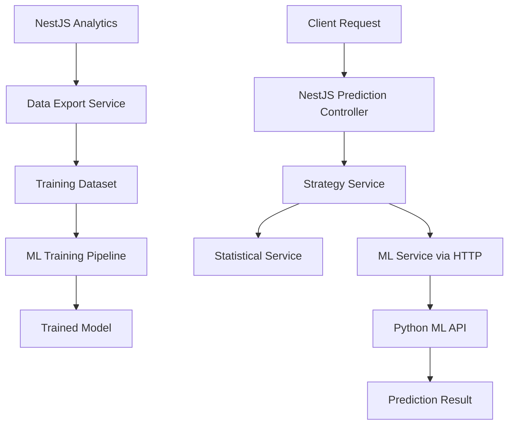

# ML Prediction Enhancement - Technical Design

## Current Statistical Model Analysis

The existing prediction service uses a weighted statistical approach:

```typescript
// Current algorithm weights:
homeScore = homeFormRating * 0.4 + homeWinRate * 0.4 + HOME_ADVANTAGE(10)
awayScore = awayFormRating * 0.4 + awayWinRate * 0.4

// H2H adjustment (if available):
homeScore += h2hHomePercent * 0.2
awayScore += h2hAwayPercent * 0.2

// Probability distribution:
// - Reserve 25% for draw probability
// - Constrain draw between 15-30%
// - Target accuracy: 60-65%
```

**Current Limitations:**
- Simple linear weighting doesn't capture complex interactions
- Fixed weights don't adapt to different league characteristics  
- No learning from prediction accuracy over time
- Limited feature engineering (missing: recent form trends, venue effects, injury impacts)

---

## ML Enhancement Architecture

### 🏗️ **Microservice Architecture**

```
FootDash Backend (NestJS)
├── analytics/
│   ├── services/
│   │   ├── match-prediction.service.ts (existing)
│   │   ├── ml-prediction.service.ts (new proxy)
│   │   └── prediction-strategy.service.ts (A/B testing)
│   └── controllers/
│       └── predictions.controller.ts (enhanced)

ML Prediction Service (Python)
├── app/
│   ├── main.py (FastAPI server)
│   ├── models/
│   │   ├── match_predictor.py
│   │   ├── feature_engineer.py
│   │   └── model_trainer.py
│   ├── api/
│   │   ├── prediction_routes.py
│   │   └── health_routes.py
│   └── utils/
│       ├── data_validator.py
│       └── model_loader.py
├── models/ (trained models storage)
├── data/ (training datasets)
├── tests/
└── requirements.txt
```

### 🔄 **Data Flow**



---

## Implementation Plan

### **Phase 1: Infrastructure Setup (Week 1)**

#### 1.1 Create ML Service Structure
```bash
ml-services/
├── prediction-model/
│   ├── Dockerfile
│   ├── requirements.txt
│   ├── app/
│   │   ├── __init__.py
│   │   ├── main.py
│   │   └── config.py
│   └── tests/
└── docker-compose.ml.yml
```

#### 1.2 FastAPI ML Service Setup

**File: `ml-services/prediction-model/app/main.py`**
```python
from fastapi import FastAPI, HTTPException
from pydantic import BaseModel
import joblib
import numpy as np
from typing import Dict, List

app = FastAPI(title="FootDash ML Prediction Service")

class PredictionRequest(BaseModel):
    home_form_rating: float
    away_form_rating: float
    home_win_rate: float
    away_win_rate: float
    home_goals_avg: float
    away_goals_avg: float
    home_goals_conceded_avg: float
    away_goals_conceded_avg: float
    h2h_home_wins: int
    h2h_away_wins: int
    h2h_draws: int
    is_home: bool
    league_id: int
    season: str

class PredictionResponse(BaseModel):
    home_win_probability: float
    draw_probability: float
    away_win_probability: float
    confidence: str
    model_version: str
    features_used: List[str]

@app.post("/predict", response_model=PredictionResponse)
async def predict_match(request: PredictionRequest):
    # Model inference logic here
    pass

@app.get("/health")
async def health_check():
    return {"status": "healthy", "model_loaded": True}
```

#### 1.3 NestJS ML Proxy Service

**File: `backend/src/analytics/services/ml-prediction.service.ts`**
```typescript
@Injectable()
export class MLPredictionService {
  private readonly mlApiUrl: string;
  private readonly httpService = new HttpService();
  
  constructor() {
    this.mlApiUrl = process.env.ML_SERVICE_URL || 'http://localhost:8000';
  }

  async generateMLPrediction(matchData: MLPredictionRequest): Promise<PredictionResult> {
    try {
      const response = await this.httpService.post(
        `${this.mlApiUrl}/predict`,
        matchData
      ).toPromise();
      
      return this.transformMLResponse(response.data);
    } catch (error) {
      this.logger.error('ML service unavailable, falling back to statistical model');
      throw new ServiceUnavailableException('ML prediction service unavailable');
    }
  }
}
```

### **Phase 2: Model Training & Integration (Week 2)**

#### 2.1 Data Export Service

**File: `backend/src/analytics/controllers/data-export.controller.ts`**
```typescript
@Controller('analytics/export')
@UseGuards(AdminGuard) // Only admin can export training data
export class DataExportController {
  @Post('training-data')
  async exportTrainingData(
    @Body() params: { 
      seasons: string[], 
      leagues: number[],
      includeOngoing: boolean 
    }
  ) {
    return await this.dataExportService.exportMatchesForTraining(params);
  }
}
```

#### 2.2 Feature Engineering

**Key Features for ML Model:**
```python
# Primary Features (from current model)
- home_form_rating (0-100)
- away_form_rating (0-100)  
- home_win_rate (0-100)
- away_win_rate (0-100)

# Enhanced Features
- recent_goals_avg (last 5 matches)
- recent_goals_conceded_avg (last 5 matches)
- form_trend (improving/declining)
- days_since_last_match
- h2h_goals_ratio (when available)
- league_strength_rating
- season_stage (early/mid/late)

# Engineered Features  
- form_difference (home_form - away_form)
- goal_difference_trend
- home_advantage_by_team (varies by team)
- momentum_score (recent results + goals)
```

#### 2.3 Model Training Pipeline

**File: `ml-services/prediction-model/app/models/match_predictor.py`**
```python
import xgboost as xgb
from sklearn.model_selection import train_test_split
from sklearn.metrics import log_loss, accuracy_score

class MatchPredictor:
    def __init__(self):
        self.model = None
        self.feature_names = []
        
    def train(self, training_data):
        # Feature engineering
        X, y = self.prepare_features(training_data)
        
        # Split data
        X_train, X_test, y_train, y_test = train_test_split(
            X, y, test_size=0.2, random_state=42
        )
        
        # Train XGBoost classifier
        self.model = xgb.XGBClassifier(
            objective='multi:softprob',
            n_estimators=100,
            max_depth=6,
            learning_rate=0.1
        )
        
        self.model.fit(X_train, y_train)
        
        # Evaluate
        predictions = self.model.predict_proba(X_test)
        accuracy = accuracy_score(y_test, np.argmax(predictions, axis=1))
        
        return {
            'accuracy': accuracy,
            'log_loss': log_loss(y_test, predictions),
            'feature_importance': dict(zip(self.feature_names, self.model.feature_importances_))
        }
```

### **Phase 3: A/B Testing & Optimization (Week 3)**

#### 3.1 Prediction Strategy Service

**File: `backend/src/analytics/services/prediction-strategy.service.ts`**
```typescript
@Injectable()
export class PredictionStrategyService {
  constructor(
    private statisticalService: MatchPredictionService,
    private mlService: MLPredictionService,
    private configService: ConfigService
  ) {}

  async getPrediction(matchId: number): Promise<PredictionResult> {
    const useMLModel = this.shouldUseMLModel(matchId);
    
    if (useMLModel) {
      try {
        const mlPrediction = await this.mlService.generateMLPrediction(matchId);
        mlPrediction.metadata.model_type = 'ml';
        return mlPrediction;
      } catch (error) {
        // Fallback to statistical
        this.logger.warn('ML service failed, using statistical fallback');
      }
    }
    
    const statistical = await this.statisticalService.generatePrediction(matchId);
    statistical.metadata.model_type = 'statistical';
    return statistical;
  }

  private shouldUseMLModel(matchId: number): boolean {
    // A/B testing logic - 50/50 split initially
    const abTestEnabled = this.configService.get('ML_AB_TEST_ENABLED');
    if (!abTestEnabled) return false;
    
    return matchId % 2 === 0; // Simple split based on match ID
  }
}
```

#### 3.2 Model Performance Monitoring

**File: `backend/src/analytics/entities/prediction-performance.entity.ts`**
```typescript
@Entity('prediction_performance')
export class PredictionPerformance {
  @PrimaryGeneratedColumn()
  id: number;

  @Column()
  matchId: number;

  @Column({ type: 'enum', enum: ['statistical', 'ml'] })
  modelType: string;

  @Column({ type: 'jsonb' })
  prediction: {
    homeWin: number;
    draw: number;
    awayWin: number;
  };

  @Column({ type: 'enum', enum: ['HOME_WIN', 'DRAW', 'AWAY_WIN'] })
  actualOutcome: string;

  @Column({ type: 'boolean' })
  wasCorrect: boolean;

  @Column({ type: 'float' })
  confidenceScore: number;

  @CreateDateColumn()
  predictedAt: Date;

  @Column({ nullable: true })
  evaluatedAt: Date;
}
```

---

## Expected Improvements

### **Accuracy Gains**
- **Current:** 60-65% accuracy with statistical model
- **Target:** 70-75% accuracy with ML model
- **Key improvements:**
  - Non-linear feature interactions
  - Adaptive weights based on league/season
  - Better handling of team momentum and form trends

### **Feature Enhancements**
- **Confidence scoring:** ML can provide better uncertainty estimates
- **Feature importance:** Show which factors drive predictions
- **Model explanations:** "Team A favored due to superior recent form and home advantage"
- **Continuous learning:** Model improves over time with more data

### **Technical Benefits**
- **Scalability:** Microservice can be scaled independently
- **A/B testing:** Data-driven model selection
- **Monitoring:** Track model performance and drift
- **Fallback resilience:** Statistical model as backup

---

## Next Steps

1. **Week 1 Tasks:**
   - [ ] Set up Python ML service with FastAPI
   - [ ] Create Docker configuration for ML development
   - [ ] Implement basic prediction endpoints
   - [ ] Add NestJS proxy service integration
   
2. **Week 2 Tasks:**
   - [ ] Export historical match data for training
   - [ ] Implement feature engineering pipeline
   - [ ] Train initial XGBoost model
   - [ ] Add model performance evaluation
   
3. **Week 3 Tasks:**
   - [ ] Implement A/B testing framework
   - [ ] Add prediction performance tracking
   - [ ] Create admin dashboard for model monitoring
   - [ ] Deploy ML service to staging environment

This ML enhancement will significantly improve FootDash's competitive position by providing more accurate predictions while maintaining system reliability through fallback mechanisms.